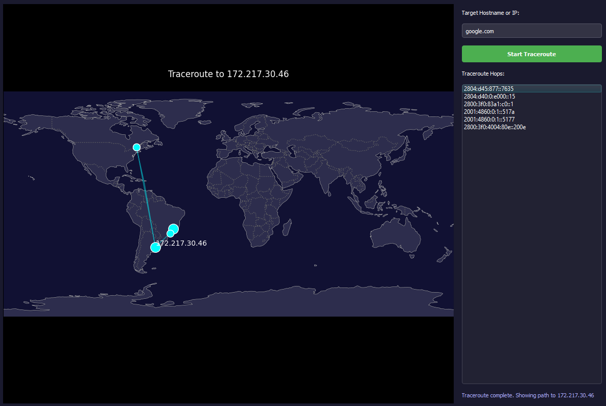

# Traceroute Visualizer

A graphical tool that visualizes the path your internet traffic takes to reach a destination, plotting each hop on an interactive world map with a sleek dark theme.

## Features

- **Cross-platform compatibility**: Works on Windows, Linux, and macOS
- **Interactive map visualization**: See your traceroute path on a beautiful dark-themed world map
- **Hop listing**: View all IP addresses in your traceroute path
- **Geolocation**: Automatically detects locations of each hop
- **Modern UI**: Dark theme with intuitive controls
- **Real-time progress**: Status updates during traceroute execution

## Requirements

- Python 3.12+ (is what I've used to run)
- Required packages (install via pip):
  ```
  pip install PyQt5 matplotlib cartopy requests
  ```

## Installation

1. Clone this repository:
   ```
   git clone https://github.com/Talkys/TracerouteUI.git
   cd TracerouteUI
   ```

2. Install dependencies:

3. Run the application:
   ```
   python traceroute_ui.py
   ```

## Usage

1. Enter a target hostname or IP address (e.g., `google.com` or `8.8.8.8`)
2. Click "Start Traceroute"
3. View the path on the map and the list of hops in the sidebar

## Technical Details

The application:
- Uses system traceroute commands appropriate for your OS
- Extracts IP addresses from traceroute output
- Queries geolocation data using ip-api.com
- Plots the path using Cartopy and Matplotlib
- Provides a responsive PyQt5 interface

## Limitations

- Geolocation accuracy depends on the free ip-api.com service
- Some hops may not be geolocatable (especially private IPs)
- Traceroute may be blocked by some networks

## Screenshots





## Contributing

Contributions are welcome! Please open an issue or pull request for any improvements.

## License

MIT License - see LICENSE file for details